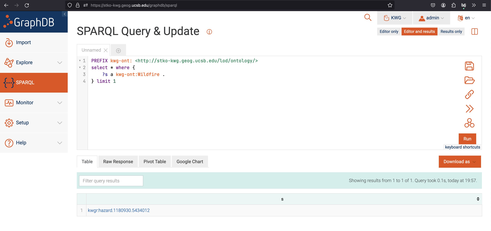
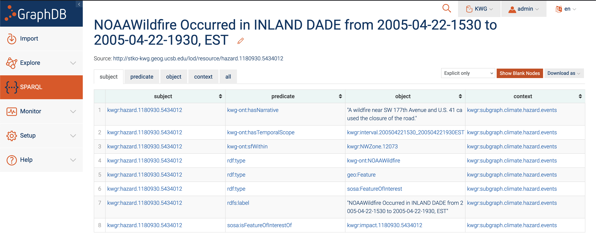
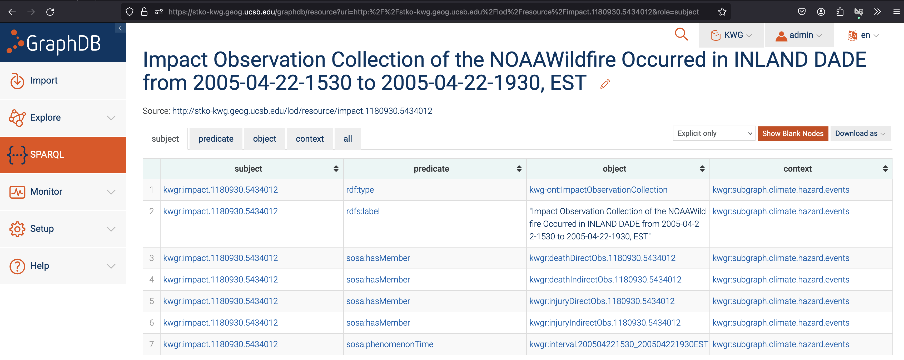
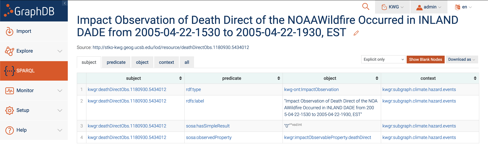
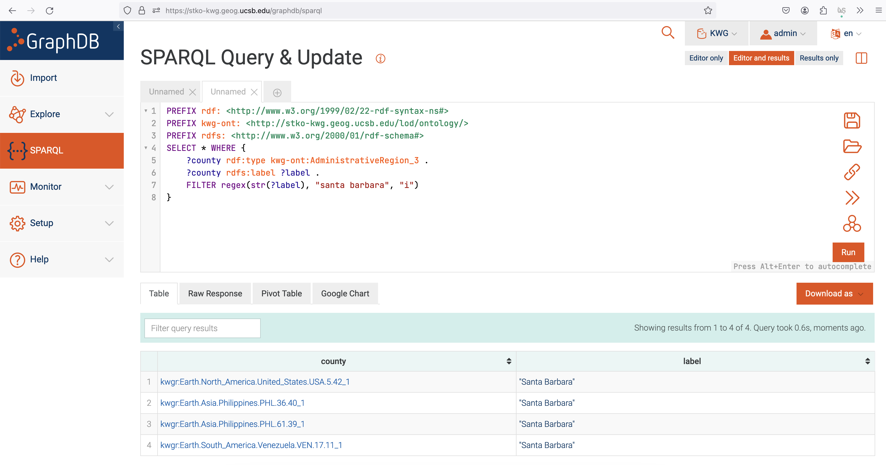
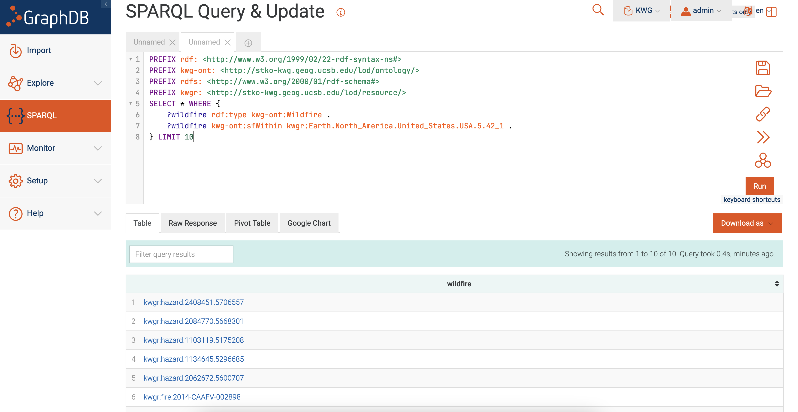
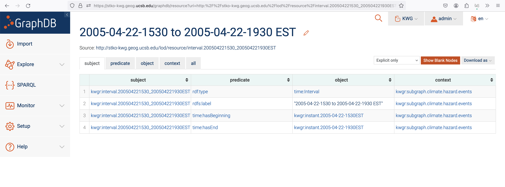
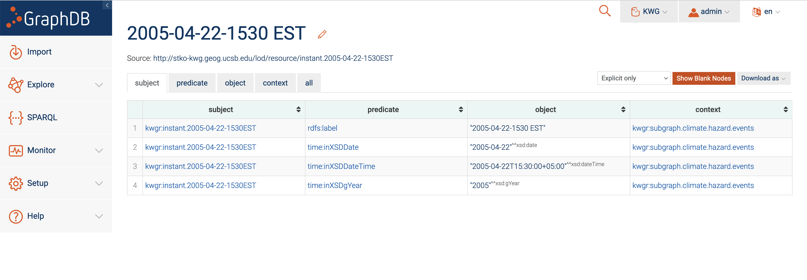

# Data Downloading Made Easy(er)

The GraphDB [SPARQL editor](https://stko-kwg.geog.ucsb.edu/graphdb/sparql) eases some of the pain of trying to come up with the correct graph patterns. One of the tried and true, pro workflows is given below for the hypothetical situation:

I want to download the following information for all wildfire events in Santa Barbara county

    a. Name

    b. Year that the wildfire started

    c. Total deaths

### Step 1: Your First Query

When navigating the graph for the data that you want, you need your first query to land you *somewhere* close to what you're after. Because we've already browsed through the [ontology](./ontology.md) (you've done this, right?) at this point and confirmed we have this data for wildfires... We know that there's a type called `kwg-ont:Wildfire`, so let's assume the nodes we're after are going to be of that type. Let's take a look at a single wildfire and see how the data connects to it.

In the image below, we did a simple query for a *single* wildfire.



### Step 2: Exploring the Node

Click on the link for [kwgr:hazard.1180930.5434012](https://stko-kwg.geog.ucsb.edu/graphdb/resource?uri=http:%2F%2Fstko-kwg.geog.ucsb.edu%2Flod%2Fresource%2Fhazard.1180930.5434012&role=subject) in the query results table to bring up the following page.



On this page, we see all the predicates that this wildfire is connected to. **This is incredibly powerful when figuring out what is connected to what, and how to write your SPARQL**.

The predicates that should jump out are

1. `kwg-ont:hasTemporalScope`: This is the relation that connects the fire to temporal information.
2. `kwg-ont:sfWithin`: This is the relation that connects the fire to spatial information.
3. `sosa:isFeatureOfInterestOf`: This is the relation that connects the fire to numeric and categorical data.

These predicates show up time and time again in KnowWhereGraph and are important to recognize.

### Step 3: Getting Numeric & Categorical Data

When thinking about data values, the SOSA ontology should be at the forefront of your mind. If you haven't already, check out the [ontology](./ontology.md) page for the gist of this ontology.

From our main Wildfire node view, navigate to the node that's in the range of sosa:isFeatureOfInterestOf ([kwgr:impact.1180930.5434012](https://stko-kwg.geog.ucsb.edu/graphdb/resource?uri=http:%2F%2Fstko-kwg.geog.ucsb.edu%2Flod%2Fresource%2Fimpact.1180930.5434012&role=subject)). On this page (shown below), we see that familiar structure of an observation collection.



Looking at the different types of observations in this collection, the one named `kwgr:deathDirectObs.1180930.5434012` should stick out. Sort of sounds like this node might be related to deaths from the wildfire, right?

Let's click on that observation to see what data lies inside.



Bingo. We see that there's a numeric value that represents the number of people that have died from this wildfire, completing our path from a node of type `kwg-ont:Wildfire` to the actual data value.

All together, we can create a query starting with the Wildfire and ending at the observation collection member for direct deaths as follows.

```SPARQL
PREFIX kwg-ont: <http://stko-kwg.geog.ucsb.edu/lod/ontology/>
PREFIX sosa: <http://www.w3.org/ns/sosa/>
PREFIX rdf: <http://www.w3.org/1999/02/22-rdf-syntax-ns#>
PREFIX kwgr: <http://stko-kwg.geog.ucsb.edu/lod/resource/>
SELECT ?fire ?direct_deaths WHERE {
    ?fire a kwg-ont:Wildfire .
    ?fire sosa:isFeatureOfInterestOf ?observation_collection .
    ?observation_collection sosa:hasMember ?observation_member .
    ?observation_member sosa:observedProperty kwgr:impactObservableProperty.deathDirect .
    ?observation_member sosa:hasSimpleResult ?direct_deaths .
} LIMIT 1
```

### Step 4: Handling Spatial Data

In this step, we have to find the node that represents Santa Barbara County. Using SPARQL. From the [ontology](./ontology.md), we know that counties are going to be `kwg-ont:AdministrativeRegion_3` .

Building our query, we can start with

```SPARQL
SELECT * WHERE {
    ?s a kwg-ont:AdministrativeRegion_3 .
}
```

We also know that the words "Santa Barbara" should be in the `rdfs:label` &mdash; so let's add some REGEX to our query.

```SPARQL
SELECT * WHERE {
    ?county rdf:type kwg-ont:AdministrativeRegion_3 .
    ?county rdfs:label ?label .
    FILTER regex(str(?label), "santa barbara", "i")
}
```



From the results, we see that there are *several* counties whose names include "Santa Barbara". By process of eliminiation, we can make a good assumption that the node we're after is the first one, [Earth.North_America.United_States.USA.5.42_1](https://stko-kwg.geog.ucsb.edu/graphdb/resource?uri=http:%2F%2Fstko-kwg.geog.ucsb.edu%2Flod%2Fresource%2FEarth.North_America.United_States.USA.5.42_1&role=subject).

Referring back to the [ontology](./ontology.md) notes on how KnowWhereGraph structures spatial data, we can come to the conclusion that we want all Wildfire nodes that are `kwg-ont:sfWithin` `kwgr:Earth.North_America.United_States.USA.5.42_1`. This query is shown below.

```SPARQL
PREFIX rdf: <http://www.w3.org/1999/02/22-rdf-syntax-ns#>
PREFIX kwg-ont: <http://stko-kwg.geog.ucsb.edu/lod/ontology/>
PREFIX rdfs: <http://www.w3.org/2000/01/rdf-schema#>
PREFIX kwgr: <http://stko-kwg.geog.ucsb.edu/lod/resource/>
SELECT * WHERE {
    ?wildfire rdf:type kwg-ont:Wildfire .
    ?wildfire kwg-ont:sfWithin kwgr:Earth.North_America.United_States.USA.5.42_1 .
} LIMIT 10
```

Running this yields the following results



### Step 5: Getting Temporal Data

Looking back at our initial [Hazard node](https://stko-kwg.geog.ucsb.edu/graphdb/resource?uri=http:%2F%2Fstko-kwg.geog.ucsb.edu%2Flod%2Fresource%2Fhazard.1180930.5434012&role=subject) from Step 2, we can see that there's temporal information attached to it. We can come to that conclusion by realizing that there's a relation (`kwg-ont:hasTemporalScope`) that has words related to time in it. Now this isn't a technical approach to navigating the graph &mdash; but it's practical. If you had the ontology memorized (which honestly no one does), then you'd know that `kwg-ont:hasTemporalScope` links nodes to temporal data.

Based on the name `interval` &mdash; we can probably guess that this node is going to have some sort of start and end date. Let's take a look.

Clicking on the [kwgr:interval.200504221530_200504221930EST](https://stko-kwg.geog.ucsb.edu/graphdb/resource?uri=http:%2F%2Fstko-kwg.geog.ucsb.edu%2Flod%2Fresource%2Finterval.200504221530_200504221930EST&role=subject) object &mdash; we're brought to the node that holds the temporal relations for this Wildfire.



Again, just by looking at the relations we can mostly tell what we're looking at. We see two relations of interest &mdash; one that represents the beginning of the wildfire, and one that represents the end. Let's click on the node that represents the beginning.



Recall that we want the year that each wildfire began. Without referencing the ontology, we should be able to tell that `time:inXSDgYear` is the predicate that we want.

Using the path that we just followed, we can write a small proof-of-concept query that gets the years of wildfires.

```SPARQL
PREFIX kwg-ont: <http://stko-kwg.geog.ucsb.edu/lod/ontology/>
PREFIX time: <http://www.w3.org/2006/time#>
select ?year where {
    ?wildfire a kwg-ont:Wildfire .
    ?wildfire kwg-ont:hasTemporalScope ?temporal_scope .
    ?temporal_scope time:hasBeginning ?wilfire_start .
    ?wildfire_start time:inXSDgYear ?year .
} limit 10
```

### Step 6: Combining Everything Together

Now that we have separate queries to get

1. Wildfires
2. Wildfires within Santa Barbara County
3. Number of deaths per wildfire
4. Year each wildfire began

We'll combine them together to form our final query to get the data we want. 

```SPARQL
PREFIX kwg-ont: <http://stko-kwg.geog.ucsb.edu/lod/ontology/>
PREFIX sosa: <http://www.w3.org/ns/sosa/>
PREFIX rdf: <http://www.w3.org/1999/02/22-rdf-syntax-ns#>
PREFIX kwgr: <http://stko-kwg.geog.ucsb.edu/lod/resource/>
PREFIX rdfs: <http://www.w3.org/2000/01/rdf-schema#>
PREFIX time: <http://www.w3.org/2006/time#>
SELECT ?fire_name ?direct_deaths ?year WHERE {
    ?fire a kwg-ont:Wildfire .
    ?fire rdfs:label ?fire_name .
    ?fire kwg-ont:sfWithin kwgr:Earth.North_America.United_States.USA.5.42_1 .
    ?fire kwg-ont:hasTemporalScope ?temporal_scope .
    ?temporal_scope time:hasBeginning ?wilfire_start .
    ?wildfire_start time:inXSDgYear ?year .
    ?fire sosa:isFeatureOfInterestOf ?observation_collection .
    ?observation_collection sosa:hasMember ?observation_member .
    ?observation_member sosa:observedProperty kwgr:impactObservableProperty.deathDirect .
    ?observation_member sosa:hasSimpleResult ?direct_deaths .
} LIMIT 100
```

#### Walkthrough Summary

To summarize the steps and key points above...

1. Start small, build big.
   1. Build paths to each thing that you want.
   2. Combine the smaller queries and logic together to form a larger query.
2. Use the SPARQL editor to find relevant nodes and explore them in GraphDB's interface.
3. The temporal, spatial, and data representations are similar throughout the database. Learn each and be able use the same pattern everywhere.
