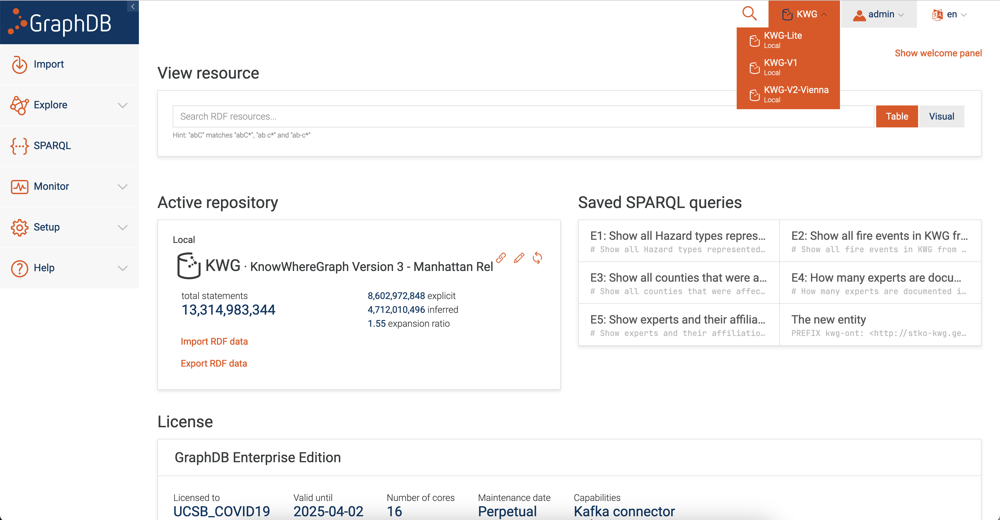

# Data Download

KnowWhereGraph doesn't supply data dumps, datasets, or an API for querying various types of information. Instead, each version of the graph has a SPARQL endpoint and it's left to **you** to construct SPARQL queries to fetch data.

## Choosing a Graph

KnowWhereGraph keeps old versions of the graph around so that existing users don't experience breaking changes. Each successive graph contains bug fixes and possibly new data. For these reasons, it's suggested that you use the latest.

The most recent, cutting edge graph will **always** be named `KWG`. This is almost certainly the graph that you want to query.

To find the names of the supported graphs,

1. Navigate to https://stko-kwg.geog.ucsb.edu/graphdb/

2. On the upper right side, there's a dropdown for `Repositories`, shown in the image below. These are the names of each graph within the project. In the image below, the `KWG` repository is selected, with options for previous versions of the graph.



### Graph Endpoint

The endpoint is constructed as `https://stko-kwg.geog.ucsb.edu/graphdb/repositories/repository_name_here`.  

The endpoint to the latest graph is always **https://stko-kwg.geog.ucsb.edu/graphdb/repositories/KWG**. You almost certainly want to use this one.

## Connecting to the Endpoint

There are a number of clients and libraries for downloading data from SPARQL endpoints. We recommend SPARQLWrapper with Python.

Example

```python
from SPARQLWrapper import SPARQLWrapper, JSON

# Set the SPARQL endpoint and request that the response is in JSON
sparql = SPARQLWrapper("https://stko-kwg.geog.ucsb.edu/graphdb/repositories/KWG")
sparql.setReturnFormat(JSON)

query = """
    PREFIX kwg-ont: <http://stko-kwg.geog.ucsb.edu/lod/ontology/>
    SELECT * WHERE { 
    ?s ?p ?o .
    } LIMIT 1
    """
sparql.setQuery(query)
query_result = sparql.queryAndConvert()
print(query_result)
```

## Going Further

Chances are, you'll want to do than just select one node from the graph. To successfully obtain the data that you need you'll need to first understand the structure of the ontology, which is admittingly not a small task. Rather than becoming familiar with the *entire* ontology - it's recommended that you understand the local area that you're interested in. For example, viewing the ontology documentation for nodes of type `Hazard` and their connections to numerical data.

Reading the ontology, writing a SPARQL query, and referring back to the ontology will undoubtedly be a staple of your data acquisition workflow.

## Walkthrough

**It is highly suggested that you go through the [Walkthrough](/./data-download-walkthrough.md)**. This page will cover how to use GraphDB's interface rather than relying solely on the ontology to figure out how nodes are connected and how to find the data you need.

## Summary

To download data

1. Pick which graph you want (almost certainly `KWG`)
2. Construct the endpoint (almost certainly `https://stko-kwg.geog.ucsb.edu/graphdb/repositories/KWG`)
3. Choose a SPARQL interface (we suggest SPARQLWrapper)
4. Figure out the local structure of the graph for the data you need (refer to the walkthrough)
5. Write your SPARQL queries
6. Submit the queries to the SPARQL endpoint for the data
